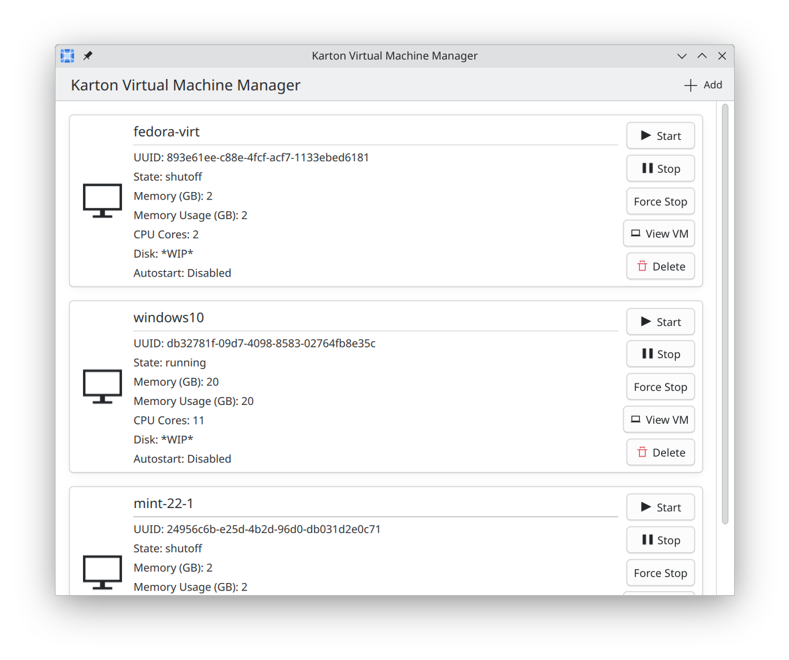
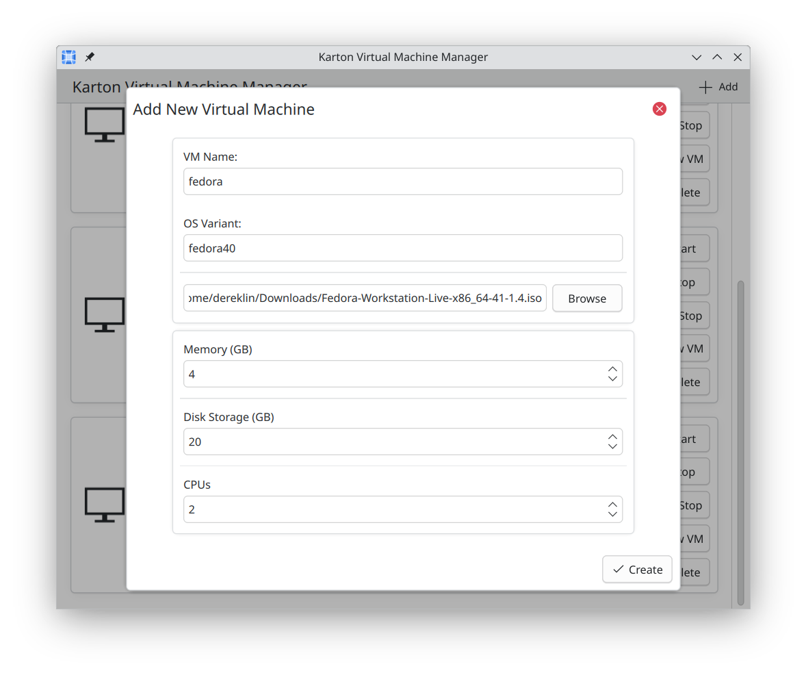
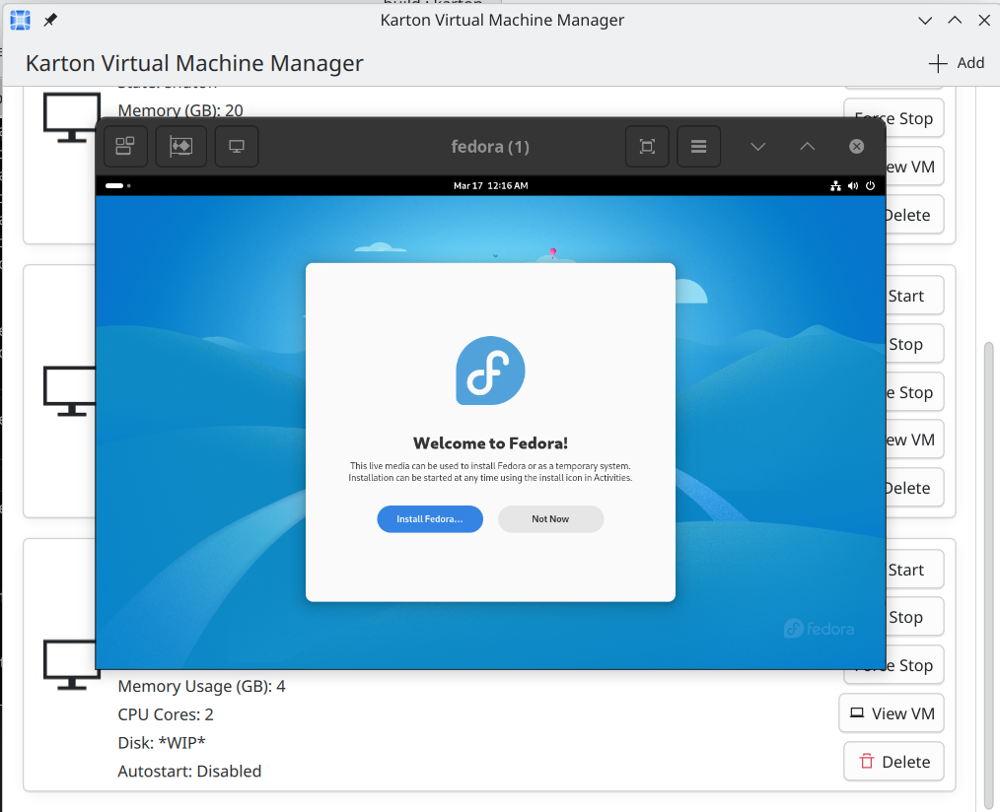

<!--
SPDX-License-Identifier: CC0-1.0
SPDX-FileCopyrightText: 2024 Aaron Rainbolt <arraybolt3@gmail.com>
SPDX-FileCopyrightText: 2025 Derek Lin <derekhongdalin@gmail.com>
-->

# Karton 
A libvirt-based Virtual Machine Manager for KDE.

## WARNING
This project is still in early development and will likely break existing virtual machines.

## Features
- Displays list of existing VMs
- Basic functionality to start, stop, and view VMs
- Installing and deleting VMs

## Dependencies
- Kirigami
- Kirigami Addons
- Qt Quick Controls
- libvirt
- spice-client-glib
- libosinfo

## Installation
```
git clone https://invent.kde.org/sitter/karton.git
cd karton
mkdir build
cd build
cmake ..
make -j$(nproc)
sudo make install
```
Check your app menu for "Karton", it should be hiding under the "System" section.

## Gallery





## We hope you find Karton useful!

Feel free to join our matrix at [#karton:kde.org](https://matrix.to/#/#karton:kde.org).